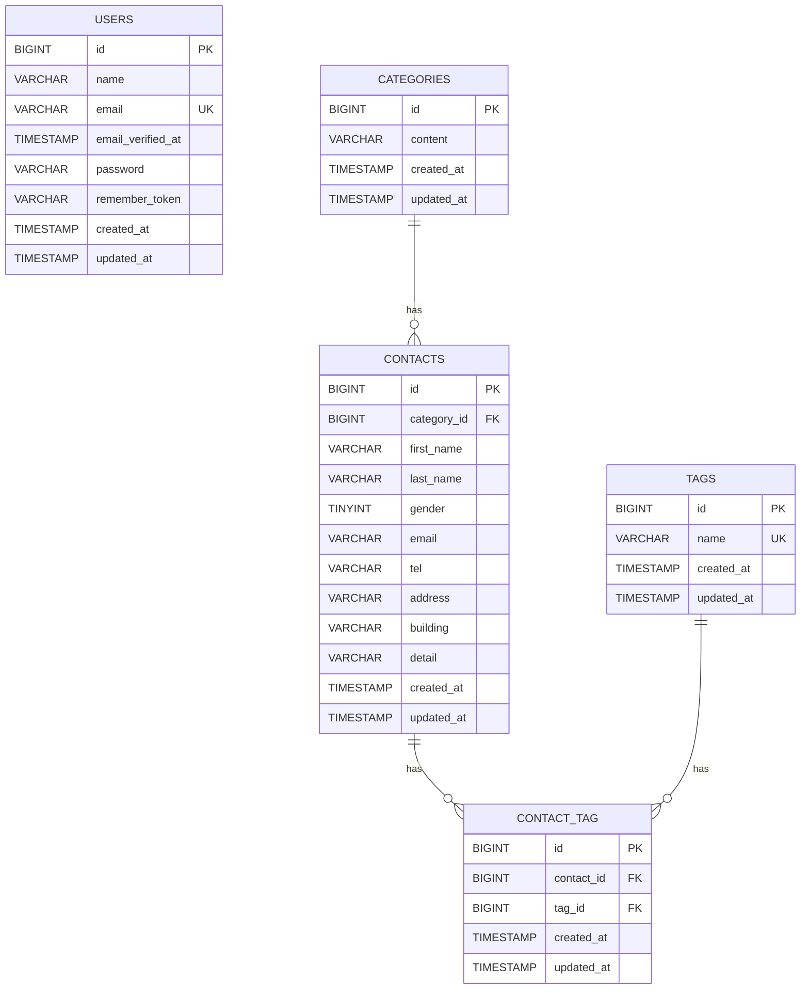

# お問い合わせフォーム

Laravelを使用して作成したお問い合わせフォームです。

## 概要

ユーザーがお問い合わせ内容を入力・確認・送信できるお問い合わせフォームと、管理者が問い合わせ内容を管理できる管理画面を実装しています。

また、Laravel Fortifyを使用した認証機能と、RESTful APIによるお問い合わせデータの操作機能を実装しています。

## 実装した機能

### ユーザー側

* お問い合わせフォーム
* 入力内容のバリデーション
* 確認画面
* お問い合わせ送信
* 送信完了画面
* カテゴリ選択
* タグ選択

### 管理者側

* ログイン・ログアウト
* お問い合わせ一覧
* ページネーション（7件ずつ）
* 名前・メールアドレスによる検索
* 性別による絞り込み
* カテゴリによる絞り込み
* 日付による絞り込み
* お問い合わせ詳細表示
* お問い合わせ削除
* タグの登録・編集・削除
* CSVエクスポート
* 絞り込み条件を反映したCSVエクスポート

### API

お問い合わせデータを操作するRESTful APIを実装。

* お問い合わせ一覧取得
* キーワード検索
* 性別・カテゴリ・日付による絞り込み
* ページネーション
* お問い合わせ詳細取得
* お問い合わせ登録
* お問い合わせ更新
* お問い合わせ削除

## ER図



### テーブル構成

* `users`：管理者ユーザー
* `categories`：お問い合わせカテゴリ
* `contacts`：お問い合わせ情報
* `tags`：お問い合わせタグ
* `contact_tag`：お問い合わせとタグの中間テーブル

`categories` と `contacts` は1対多の関係。

`contacts` と `tags` は多対多の関係で、`contact_tag` を中間テーブルとして使用。

## 環境構築

### 必要な環境

* Docker Desktop
* Git

### 1. リポジトリをクローン

```bash
git clone <GitHubリポジトリURL>
cd contact-form-app
```

### 2. `.env`を作成

```bash
cp .env.example .env
```

`.env`のデータベース設定を以下のようにする。

```env
DB_CONNECTION=mysql
DB_HOST=mysql
DB_PORT=3306
DB_DATABASE=laravel
DB_USERNAME=sail
DB_PASSWORD=password
```

### 3. Composerパッケージをインストール

Docker上でComposerを実行。

```bash
docker run --rm \
    -u "$(id -u):$(id -g)" \
    -v "$(pwd):/var/www/html" \
    -w /var/www/html \
    laravelsail/php82-composer:latest \
    composer install
```

### 4. Laravel Sailを起動

```bash
./vendor/bin/sail up -d
```

### 5. アプリケーションキーを生成

```bash
./vendor/bin/sail artisan key:generate
```

### 6. フロントエンドパッケージをインストール

```bash
./vendor/bin/sail npm install
```

### 7. データベースを作成・初期データを登録

```bash
./vendor/bin/sail artisan migrate --seed
```

データベースを初期状態から作り直す場合は、以下を使用。

```bash
./vendor/bin/sail artisan migrate:fresh --seed
```

### 8. Viteを起動

```bash
./vendor/bin/sail npm run dev
```

## 開発環境

| 項目                  | 内容                    |
| ------------------- | --------------------- |
| Framework           | Laravel 10            |
| PHP                 | PHP 8.5               |
| Database            | MySQL 8.4             |
| Web Server          | Nginx                 |
| Container           | Docker / Laravel Sail |
| Database Management | phpMyAdmin            |
| Authentication      | Laravel Fortify       |
| API Authentication  | Laravel Sanctum       |
| CSS                 | Tailwind CSS          |
| JavaScript          | Alpine.js             |
| Frontend Build Tool | Vite                  |

## APIエンドポイント

| Method | Endpoint                     | 内容                          |
| ------ | ---------------------------- | --------------------------- |
| GET    | `/api/v1/contacts`           | お問い合わせ一覧取得・検索・絞り込み・ページネーション |
| GET    | `/api/v1/contacts/{contact}` | お問い合わせ詳細取得                  |
| POST   | `/api/v1/contacts`           | お問い合わせ登録                    |
| PUT    | `/api/v1/contacts/{contact}` | お問い合わせ更新                    |
| PATCH  | `/api/v1/contacts/{contact}` | お問い合わせ更新                    |
| DELETE | `/api/v1/contacts/{contact}` | お問い合わせ削除                    |

### APIの主なパラメータ

一覧取得では以下の条件を指定可能。

* `keyword`
* `gender`
* `category_id`
* `date`
* `per_page`
* `page`

APIはJSON形式でレスポンスを返す。

## 開発用URL

### お問い合わせフォーム

http://localhost

### 管理画面

http://localhost/admin

### phpMyAdmin

http://localhost:8080

## テスト

Feature TestおよびUnit Testを実装。

テストを実行する場合：

```bash
./vendor/bin/sail artisan test
```

コードスタイルを確認する場合：

```bash
./vendor/bin/sail bin pint --test
```

コードスタイルを自動修正する場合：

```bash
./vendor/bin/sail bin pint
```

## 作成者

[作成者名]
